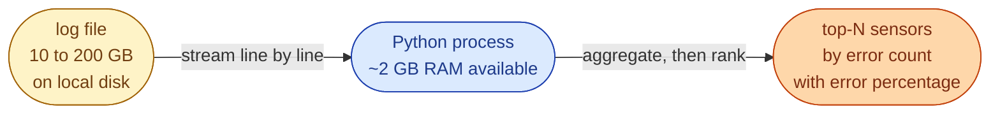

# Problem 1, Log File Error Analysis

## Scenario

An IoT platform writes one log line per sensor reading. You are handed a single rotated log file that is **between 10 and 200 GB** and asked to figure out which sensors are misbehaving. The file lives on a single disk on a single machine. You do not have a cluster. You have one shift.

Each line has three space-separated fields.

```
2025-10-11T13:45:20Z sensor_12 OK
2025-10-11T13:45:21Z sensor_45 ERROR
2025-10-11T13:45:22Z sensor_12 ERROR
2025-10-11T13:45:25Z sensor_99 OK
```



The file does not fit in RAM. Sorting the whole thing on disk is wasteful when you only want the top 5.

## Task

Write a Python program that:

1. Reads the log file as a stream. The whole file must never be in memory at once.
2. Counts how many times each sensor reported `ERROR`.
3. Prints the top 5 sensors by error count, along with their OK count and their error rate.

## Bonus

- Handle the case where the sensor cardinality is itself in the millions and the counter dict would not fit in memory. Mention what data structure you would reach for.
- Mention how the solution changes if the file is on object storage (S3 or GCS) instead of local disk.

## What a Good Answer Covers

- A clear progression: brute force, the obvious right answer, then memory-bounded variants.
- Time and space complexity stated for each approach.
- An honest discussion of when each one is the right choice.
- Awareness that the right answer depends on the cardinality of sensors, not just the size of the file.
