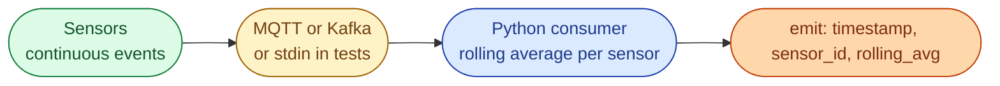

# Problem 2, Rolling Average of Sensor Readings

## Scenario

You are building a data pipeline for IoT sensors (battery storage, PV inverters, weather stations). Each sensor publishes a temperature reading every few seconds. The stream never ends.

```
2025-10-11T13:45:20Z sensor_1 25.4
2025-10-11T13:45:25Z sensor_1 26.1
2025-10-11T13:45:30Z sensor_2 22.8
2025-10-11T13:45:35Z sensor_1 27.0
2025-10-11T13:45:40Z sensor_2 23.4
```



The pipeline never stops. Memory budget is fixed per host. The number of unique sensors can grow over time.

## Task

For each incoming reading, emit a line of the form:

```
<timestamp> <sensor_id> <rolling_average>
```

where `rolling_average` is the mean of the **last 3 readings** for that sensor (including the current one).

## Constraints

- Memory must not grow with stream length. It can only grow with the number of unique sensors.
- The consumer must keep running even when an occasional line is malformed.
- The code should be easy to drop into a Kafka or MQTT consumer.

## Bonus

- Cap memory even when the sensor cardinality is huge (millions of unique IDs). Mention what data structure or eviction policy you would use.
- Make the window size configurable per sensor type.
- Discuss what changes if you need **time-based** windows (last 60 seconds) instead of **count-based** (last 3 readings).

## What a Good Answer Covers

- A clear progression: naive list, deque-based sliding window, incremental sum maintained as we go.
- Time and space complexity for each approach.
- Awareness that the right answer changes if you switch from count windows to time windows.
- Clean separation between the data structure and the I/O loop, so the same logic plugs into Kafka, MQTT, or a file.
