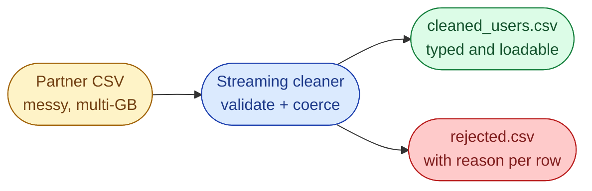

# Problem 3, Transform and Clean Raw Data for Analytics

## Scenario

A partner API drops a daily CSV of user activity into your landing bucket. The warehouse team wants it in a clean, typed shape for BigQuery. The file is large enough that pandas-style *load everything* will OOM your worker, and the data is dirty in predictable ways.

```
user_id,name,email,signup_date,last_login,total_purchases
101,John Doe,john@example.com,2024-12-01,2025-10-10,15
102,Jane Doe,,2025-01-15,2025-09-30,22
103,Bob Smith,bob@example,2024-11-20,2025-10-05,abc
104,,maria@example.com,2025-02-10,,30
```



## Cleaning rules

| Rule | What to do |
| --- | --- |
| Missing or invalid `email` | Reject the row, write to `rejected.csv` with a reason |
| Missing `name` | Replace with `"Unknown"` |
| Missing `last_login` | Replace with `"N/A"` |
| `total_purchases` not an int | Coerce to `0` |
| `signup_date > last_login` | Add `is_date_valid = False`, else `True` |

## Task

Write `cleaned_users.csv` and `rejected.csv`. Process the input as a stream. The full file must never be in memory.

## Bonus

- Log per-rule reject counts at the end (how many rows failed each rule).
- Make the validators data-driven so adding a new rule does not require a new code branch.

## What a Good Answer Covers

- Streaming with `csv.DictReader`, not pandas.
- A validator-per-column pattern so the cleaning rules are testable in isolation.
- Explicit rejected-row output with reasons (auditability matters in production).
- Time and space complexity for each approach.
