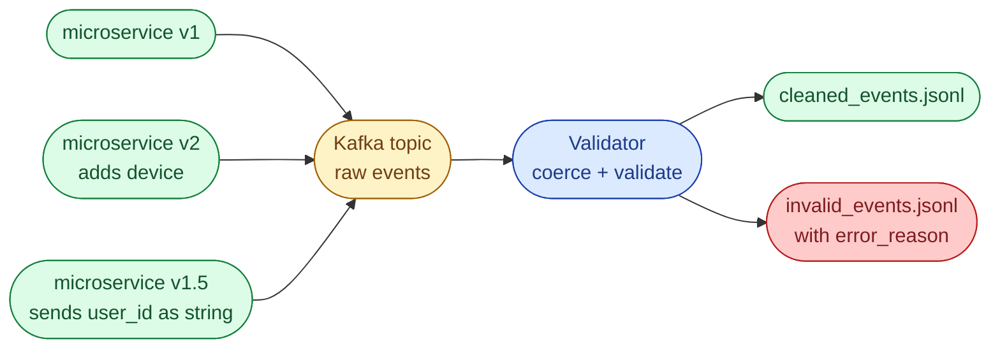

# Problem 4, Schema Evolution and Validation for Streaming Events

## Scenario

A streaming pipeline ingests user events from many microservices into Kafka. Producer teams move at different speeds: some send the v1 schema, some have already added a `device` field, some send `user_id` as a string when the contract says int. Downstream wants only clean, normalized events.

```json
{"user_id": 101, "event_type": "login", "timestamp": "2025-10-14T12:00:00Z"}
{"user_id": 102, "event_type": "purchase", "amount": 59.99, "timestamp": "2025-10-14T12:02:15Z"}
{"user_id": "103", "event_type": "logout", "timestamp": "2025-10-14T12:05:20Z"}
{"event_type": "login", "timestamp": "2025-10-14T12:07:00Z"}
```



## Schema

| Field | Type | Required | Notes |
| --- | --- | --- | --- |
| `user_id` | int | yes | Coerce from string if possible. Reject if missing or not coercible. |
| `event_type` | str | yes | One of `login`, `logout`, `purchase`. |
| `timestamp` | str | yes | Valid ISO 8601. |
| `amount` | float | no | Required for `purchase` only. Default to `0.0` if absent. |
| `device` | str | no | New optional field. Pass through if present. |
| any other field | - | no | Unknown fields are silently kept under `_extra`. |

## Task

Read `events.jsonl` line by line. Write valid normalized events to `cleaned_events.jsonl`. Write rejects to `invalid_events.jsonl` with an `error_reason`.

## Bonus

- Support schema **versioning** so a `schema_version` field on the event picks the right validator.
- Log per-error reject counts at the end.
- Discuss how this hooks into a real schema registry (Confluent, Glue) and the trade-offs versus Pydantic-only validation.

## What a Good Answer Covers

- An incremental progression: manual `try/except`, dataclass with coercion, Pydantic model with strict and lax variants.
- Awareness that unknown fields are *not* errors; they are a future-compatibility signal.
- The reject sink with reasons, because downstream owners will need it.
- Time and space complexity per approach (mostly trivial here; the interview signal is the design).
