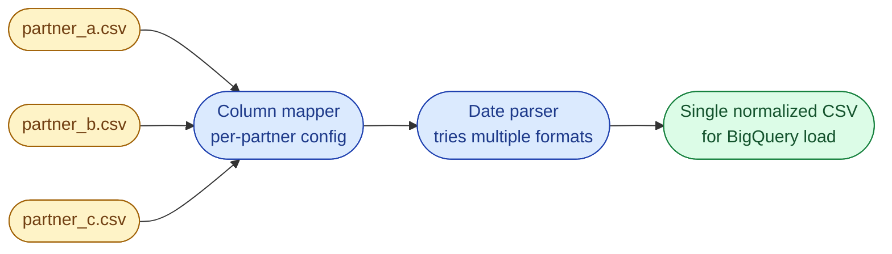

# Problem 5, Merging Messy CSVs from Multiple Partners

## Scenario

Every Monday morning, a folder of CSV files from different partners lands in your bucket. Same domain (customer signups) but every partner names columns differently, uses a different date format, and adds extra columns nobody downstream wants.

```
# partner_a.csv
customer_id,full_name,email,signup_date
201,Alice Lee,alice@a.com,2025-10-01
202,Bob Khan,bob@a.com,2025-10-02
```

```
# partner_b.csv
CustomerID,Name,Email,SignupDate,Country
301,Carol Tan,carol@b.com,2025-10-01,SG
302,,daniel@b.com,2025-10-04,MY
```

```
# partner_c.csv
cust_id,name,email_addr,joined_on
401,Eve Patel,eve@c.com,01/10/2025
402,Frank Wu,frank@c.com,02/10/2025
```



## Output

A single `customers_merged.csv` with exactly four columns: `customer_id, name, email, signup_date`. Dates normalized to ISO `YYYY-MM-DD`. Missing names replaced by `"Unknown"`. Source partner traceable on every row.

## Constraints

- The folder can contain hundreds of files. Process them as a stream, do not load all of them into memory at once.
- Column names should be matched **case-insensitively** and via aliases per partner.
- Unknown columns are silently dropped (not an error).

## Bonus

- Add a `source_file` column so analysts can trace any row back to its partner CSV.
- Add a per-file row count to the run summary at the end.
- Discuss what changes if a partner's schema drifts mid-week (new column shows up).

## What a Good Answer Covers

- A clear progression from naive read-and-merge to a config-driven mapping table.
- A date parser that tries a list of formats rather than guessing.
- A reject sink for rows that fail (you cannot just lose data quietly).
- Time and space complexity for each approach.
